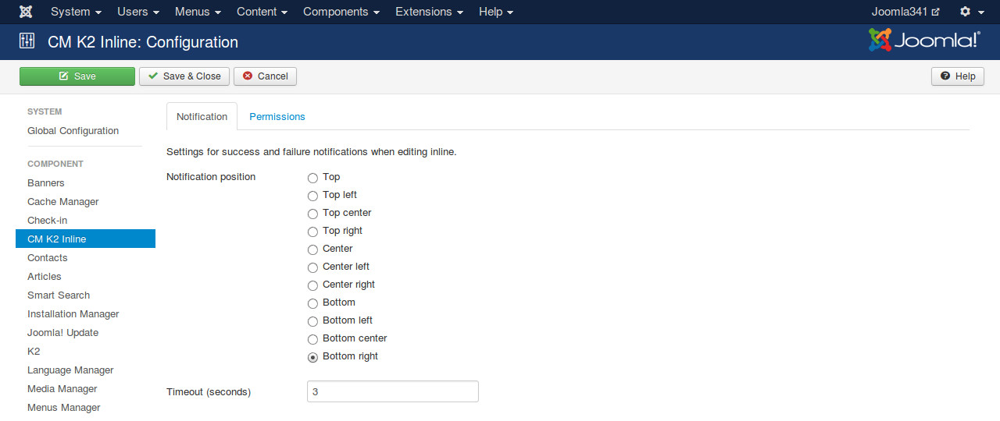

=============
Configuration
=============

To configure the component, you click on the Options button on the right of the toolbar when you are in the pages of CM K2 Inline (Template override, Columns, About).

There are 2 options that you can configure: the position of notification pop-up and how many seconds it appears on the page.