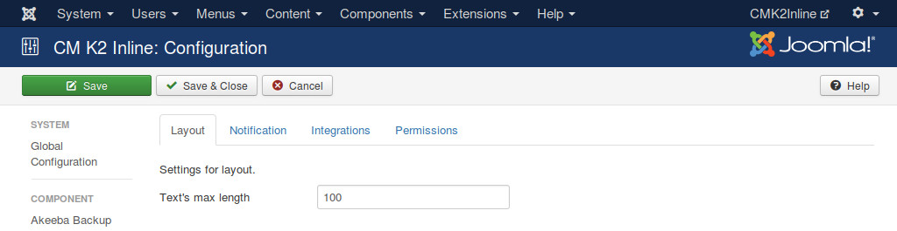
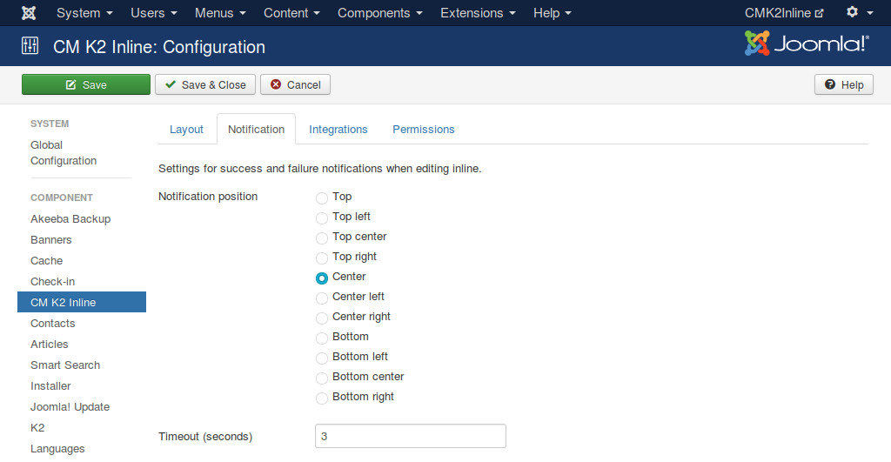
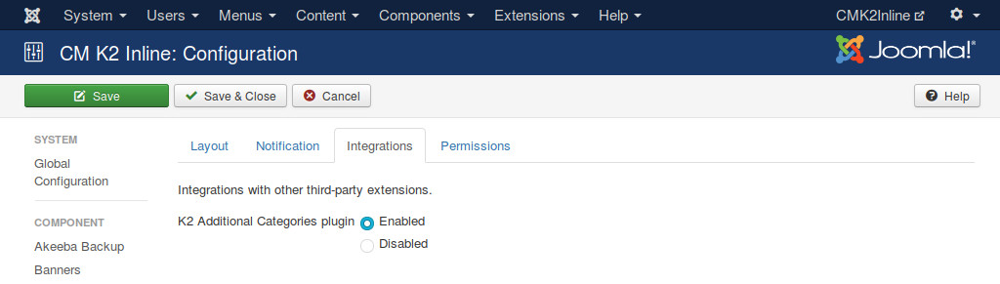

=============
Configuration
=============

To configure the component, you click on the Options button on the right of the toolbar when you are in the pages of CM K2 Inline (Template override, Columns, About).

Text's Max Length option in Layout tab gives you ability to set how long the text of Text, Textarea and Link extra field type is display in item list. If the text is longer than the length you set, it will be truncated, 3 dots are appended to the end. This prevents long texts from breaking your item list when they are displayed in full.

There are 2 options that you can configure for notification: the position of notification pop-up and how many seconds it appears on the page.

Integrations tab is where the options for the integrations with other Joomla! extensions are placed. At the present CMK2Inline only integrate with Additional Categories for K2 plugin.